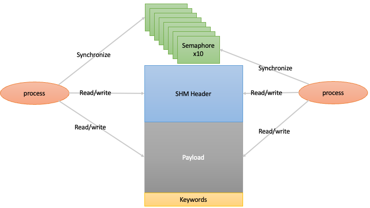

Shared Memory 
=============

DAO is based on independent processes interacting via shared memory.

This shared memory provides a low latency, high performance data interface and synchronization mechanism.

Overview
--------

The Durham AO (DAO) system uses a shared memory architecture for efficient data exchange between processes. The shared memory interface is designed to:

* Allow low-latency data transfer between processes
* Support multiple platforms (Linux, macOS, Windows)
* Provide synchronization mechanisms via semaphores
* Handle various data types for scientific computing

Core Components
---------------

The shared memory system consists of several key components:

1. **IMAGE structure**: The main container that holds metadata and points to the shared data array
2. **IMAGE_METADATA**: Contains information about the image dimensions, data type, timestamps, and counters
3. **Semaphores**: Used for inter-process synchronization when data is updated
4. **Cross-platform layer**: Abstracts system-specific implementations (POSIX vs Windows)

Supported Data Types
--------------------

The system supports the following data types:

* Integer types (8, 16, 32 and 64-bit, signed and unsigned)
* Floating point types (single and double precision)
* Complex numbers (single and double precision)

Creating Shared Memory
----------------------

To create a shared memory segment:

.. code-block:: python

   import numpy as np
   from daoShm import shm
   
   # Create 10x10 array of float32
   data = np.zeros((10, 10), dtype=np.float32)
   
   # Create shared memory with name "/tmp/example.im.shm"
   shared_mem = shm("/tmp/example.im.shm", data)

Data arrays can be created with up to three axes.

Accessing Shared Memory
-----------------------

To access an existing shared memory segment:

.. code-block:: python

   from daoShm import shm
   
   # Open existing shared memory
   shared_mem = shm("/tmp/example.im.shm")
   
   # Get data from shared memory
   data = shared_mem.get_data()

Synchronization Methods
-----------------------

The system provides two synchronization methods:

1. **Semaphores**: Using the `daoShmWaitForSemaphore` function
   
   .. code-block:: python
      
      # Wait for update using semaphore 0
      data = shared_mem.get_data(check=True, semNb=0)

By default, the shared memory is created with 10 separate semaphores for use by separate processes.

2. **Polling on Counter**: Using the `daoShmWaitForCounter` function
   
   .. code-block:: python
      
      # Wait for update using counter (spin)
      data = shared_mem.get_data(check=True, spin=True)

Cross-Platform Implementation
-----------------------------

The shared memory implementation varies by platform:

* **Linux/macOS**: Uses POSIX shared memory (`mmap`) and POSIX semaphores
* **Windows**: Uses Windows file mapping objects, file handles, and system semaphores

Metadata and Counters
---------------------

Each shared memory segment maintains several important counters:

* `cnt0`: Incremented each time the image is updated
* `cnt1`: In 3D rolling buffer images, indicates the last slice written
* `cnt2`: In event mode, records the number of events

Flags controlling or indicating the state of the shared memory are provided:
* `write`: 1 if the SHM is currently being written, and 0 otherwise. Useful for verifying the integrity of data copied from SHM

Timestamps are also recorded:

* `creation_time`: When the shared memory was created
* `last_access`: Last time the shared memory was accessed
* `atime`: Acquisition time with nanosecond precision

Accessing timestamp data:

.. code-block:: python

   # Get timestamp from shared memory
   timestamp = shared_mem.get_timestamp()

Memory Layout
------------

The shared memory segment consists of:

1. The IMAGE_METADATA structure at the beginning
2. The actual data array
3. Optional keywords (for storing additional metadata)
4. Semaphores for synchronization

Closing Shared Memory
---------------------

To properly clean up resources:

.. code-block:: python

   # Close the shared memory
   shared_mem.close()

Additionally, the `__del__` method ensures resources are freed when the object is garbage collected.

ZeroMQ Integration
------------------

The shared memory system can optionally integrate with ZeroMQ for network communication:

.. code-block:: python

   # Configure shared memory with publishing
   shared_mem = shm("/tmp/example.im.shm", data, pubPort=5555)
   
   # Enable publishing
   shared_mem.pubEnable = True
   shared_mem.pubThread.start()
   
   # On another machine, subscribe
   remote_shm = shm(subPort=5555, subHost='hostname')
   remote_shm.subEnable = True
   remote_shm.subThread.start()

C++ Interface
-----------

For C++ developers, including the ``daoShm.hpp`` header provides access
to the following shared memory interface:

.. code-block:: cpp

   // Create a shared memory segment.
   Dao::Shm(const std::string &name, const Dao::Shape &shape, T *frame); // initialize frame.
   Dao::Shm(const std::string &name, const Dao::Shape &shape);

   // Open an exisiting shared memory segment.
   Dao::Shm(const std::string &name);

   // Write frame to shared memory.
   Dao::Shm::set_frame(const T *frame);

   // Get shared memory frame.
   T* Dao::Shm::get_frame(Dao::ShmSync sync); // with synchronization.
   T* Dao::Shm::get_frame(); // no synchronization.

Information on the full C++ interface can be found in the Doxygen documentation.

C Interface
-----------

Both the C++ and Python interfaces are lightweight wrappers around the C library functions. For C developers, the following key functions are available:

.. code-block:: c

   // Create a shared memory segment
   int_fast8_t daoShmImageCreate(IMAGE *image, const char *name, long naxis, uint32_t *size,
                                uint8_t atype, int shared, int NBkw);
   
   // Access an existing shared memory segment
   int_fast8_t daoShmShm2Img(const char *name, IMAGE *image);
   
   // Write data to shared memory
   int_fast8_t daoShmImage2Shm(void *im, uint32_t nbVal, IMAGE *image);
   
   // Wait for updates
   int_fast8_t daoShmWaitForSemaphore(IMAGE *image, int32_t semNb);
   int_fast8_t daoShmWaitForCounter(IMAGE *image);
   
   // Clean up
   int_fast8_t daoShmCloseShm(IMAGE *image);

Additionally, the C interface provides partial write functions, which can be useful when working with packetised data over
a network (e.g. receiving frames from GigE Vision cameras). Information on the complete C interface can be found in the
Doxygen documentation.
