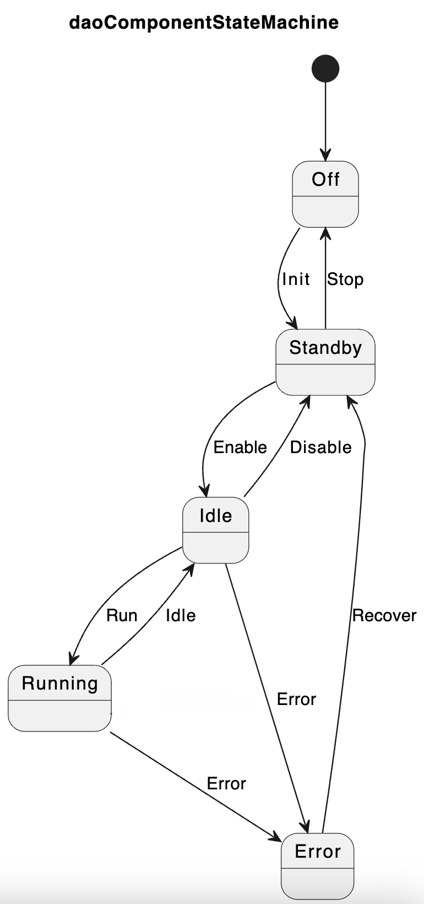

State Machines
==============

Overview
--------

The **Dao** framework provides a C++ **state machine** class for implementing state-driven behavior in real-time applications. The state machine enforces a defined set of states and allowed transitions, validating all requested state changes. It supports user-defined entry, transition, and exit hooks for customizing behavior during state transitions.

States
------

Each state represents a distinct phase in the object's lifecycle, with the 
state machine initially starting in the **Off** state. The table below
lists the defined states and their respective meanings:

+-------------+---------------------------------------------------------------+
| **State**   | **Description**                                               |
+=============+===============================================================+
| **Off**     | The object is inactive. No initialization or configuration    |
|             | has taken place.                                              |
+-------------+---------------------------------------------------------------+
| **Standby** | The object is now configured.                                 |
+-------------+---------------------------------------------------------------+
| **Idle**    | The object is ready to run but not actively processing yet.   |
|             | Resources are allocated at this stage.                        |
+-------------+---------------------------------------------------------------+
| **Running** | The object is actively performing its processing or task.     |
+-------------+---------------------------------------------------------------+
| **Error**   | The object encountered an error.                              |
+-------------+---------------------------------------------------------------+

Events
------

State transitions are initiated by posting events to the state machine using the
``Dao::StateMachine::postEvent(Events event)`` method. This is a thread-safe 
method and can thus be invoked concurrently from multiple threads; in the case of
multiple simultaneous events being posted, one will be carried out and the rest ignored.

Before performing a transition, the state machine validates whether the requested
state change is permitted. If allowed, it invokes the exit hook of the current state,
followed by the transition logic for this event, ending with the invocation of the
new state's entry hook. However, if the transition is not permitted, then
the request is simply ignored.

The state machine will catch any exceptions thrown by the current event's
hooks or transition function and will redirect the state from the requested
state directly to the **Error** state to indicate a failure.

The table below summarizes the available events and the state transitions that they trigger.

+---------------+--------------------------------------------------------------+
| **Event**     | **Purpose**                                                  |
+===============+==============================================================+
| ``Init``      | Initialize the object from the **Off** state into            |
|               | **Standby**.                                                 |
+---------------+--------------------------------------------------------------+
| ``Stop``      | Stop operation and return to the **Off** state.              |
+---------------+--------------------------------------------------------------+
| ``Enable``    | Transition from **Standby** to **Idle**, enabling the object |
|               | for operation.                                               |
+---------------+--------------------------------------------------------------+
| ``Disable``   | Transition from **Idle** to **Standby**, disabling operation.|
+---------------+--------------------------------------------------------------+
| ``Run``       | Transition from **Idle** to **Running** to start processing. |
+---------------+--------------------------------------------------------------+
| ``Idle``      | Transition from **Running** to **Idle** to stop processing.  |
+---------------+--------------------------------------------------------------+
| ``OnFailure`` | Triggered when a failure occurs, transitioning to **Error**. |
+---------------+--------------------------------------------------------------+
| ``Recover``   | Attempt recovery from **Error**, transitioning to **Idle**.  |
+---------------+--------------------------------------------------------------+

Custom Logic
------------

Each state provides **entry** and **exit** hooks that are invoked whenever
the state machine transitions into or out of that state. Additionally, 
each permitted state change may define a **transition** function
to encapsulate logic that should occur during that specific transition.

Below are the available hooks and transitions that can be overridden by the
user to implement custom logic during state transitions.

Hooks
~~~~~

.. code-block:: cpp

    void entry_Off() override;
    void exit_Off() override;
    void entry_Standby() override;
    void exit_Standby() override;
    void entry_Idle() override;
    void exit_Idle() override;
    void entry_Running() override;
    void exit_Running() override;
    void entry_Error() override;
    void exit_Error() override;

Transitions
~~~~~~~~~~~

.. code-block:: cpp

    void transition_Off_Standby() override;
    void transition_Standby_Off() override;
    void transition_Standby_Idle() override;
    void transition_Idle_Standby() override;
    void transition_Idle_Running() override;
    void transition_Running_Idle() override;
    void transition_Idle_Error() override;
    void transition_Running_Error() override;
    void transition_Error_Idle() override;

To customize the behavior of a state machine object, derive from the base
state machine class and override the desired hooks or transition functions,
as shown in the example below.

.. code-block:: cpp

    #include <daoComponent.hpp>
    
    class MyComponent : public Dao::Component
    {
    public:
        MyComponent(std::string name, Dao::Log::Logger& logger, 
                    std::string ip, int port, int core = -1)
        : Component(name, logger, ip, port, core)
        {
            // Custom initialization
        }
        
    protected:
        // Override state machine hooks
        void entry_Idle() override 
        {
            // Custom idle state entry
            Component::entry_Idle();
        }
        
        void transition_Idle_Running() override
        {
            // Custom transition logic
            Component::transition_Idle_Running();
        }
        
    private:
        // Component-specific members
    };
